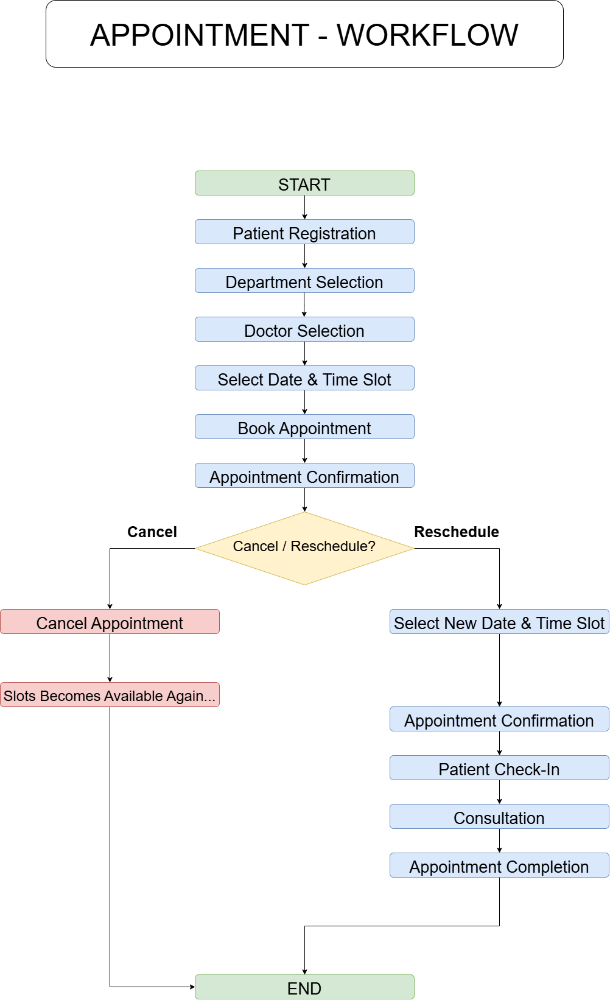

# Appointment Workflow

## Objective

The Appointment Workflow describes the complete lifecycle of a patient appointment in a Hospital Information Management System (HIMS). It ensures that appointments are booked, managed, and completed in a structured and efficient manner.

## Workflow Steps

### 1. Patient Registration

The patient is registered in the hospital system. Personal information such as name, age, gender, mobile number, email, and UHID (Unique Hospital ID) is stored.

### 2. Department Selection

The patient selects the appropriate medical department based on the required treatment (e.g., Cardiology, Orthopedics, Neurology).

### 3. Doctor Selection

The system displays the available doctors within the selected department. The patient chooses a doctor.

### 4. Date and Time Slot Selection

Available appointment slots are displayed. The patient selects a suitable date and time.

### 5. Appointment Booking

The appointment details are saved in the system, and a unique appointment number is generated.

### 6. Appointment Confirmation

The patient receives confirmation of the appointment through the system.

### 7. Patient Check-In

On the appointment day, the patient checks in at the hospital reception.

### 8. Consultation

The doctor examines the patient and provides diagnosis or treatment.

### 9. Appointment Completion

After the consultation is finished, the appointment status is updated to "Completed".

## Cancellation

A patient may cancel an appointment before the consultation. Once cancelled, the time slot becomes available for another booking.

## Rescheduling

Instead of cancelling, the patient may choose a different available date and time. The system updates the appointment and sends a new confirmation.

---

# Appointment Workflow Diagram

The following diagram illustrates the complete lifecycle of an appointment, from patient registration to appointment completion, including cancellation and rescheduling options.

